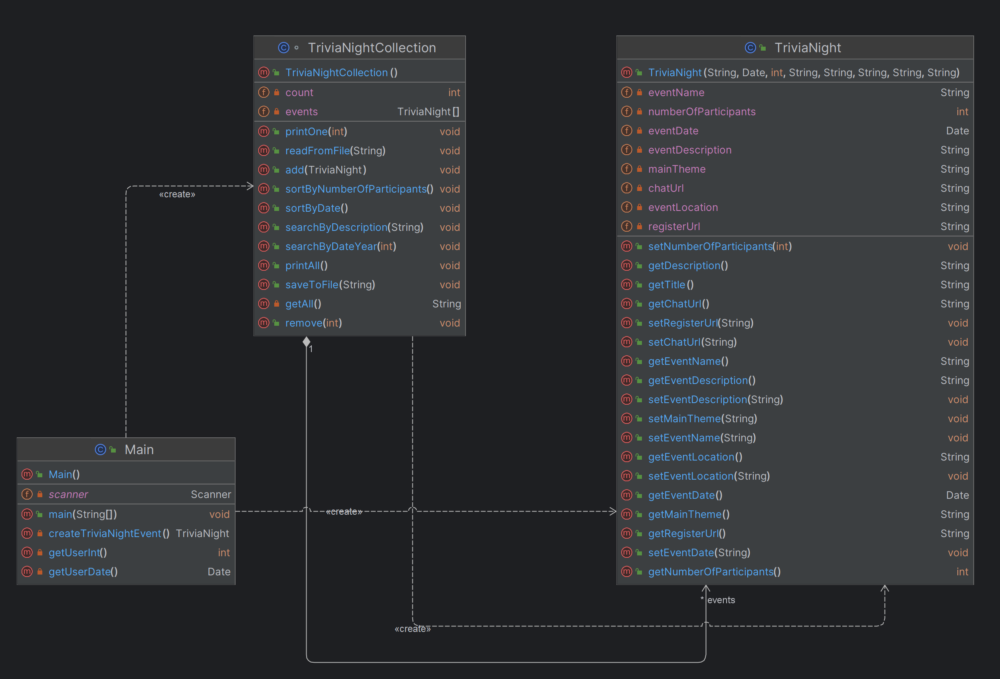

# Project 11. Complex project: Trivia Night Event Management System
This project is a Trivia Night event management system written in Java. It allows users to add, remove, print, sort, search, save, and load Trivia Night events.

## Project Structure

The project directory structure is organized as follows:
<pre>
auk_project_11/
│
├── public/
│   └── static/
│       └── [screenshots]
│
├── .idea/
├── out/
├── src/
│   ├── Main.java
│   └── TriviaNight.java
│
├── .gitignore
├── auk_project_11.iml
└── sample_events.txt
</pre>

- `.idea/`: IntelliJ IDEA configuration files (may vary based on your IDE).
- `out/`: Compiled Java classes (generated by the IDE or build tool).
- `src/`: Source code directory containing Java classes.
    - `Main.java`: The main class for interacting with the Trivia Night event system.
    - `TriviaNight.java`: The class representing Trivia Night events and related methods.
- `.gitignore`: Git configuration to ignore certain files and directories.
- `auk_project_11.iml`: IntelliJ IDEA project file.
- `sample_events.txt`: Sample event data file.

## Usage

1. Run the `Main.java` class to start the interactive user interface.
2. Follow the on-screen instructions to manage Trivia Night events.

## Class Diagram

